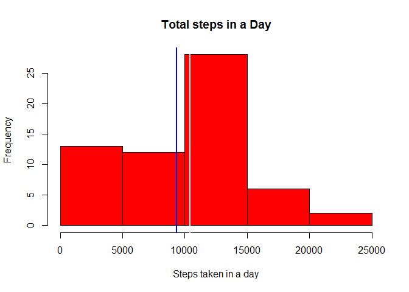
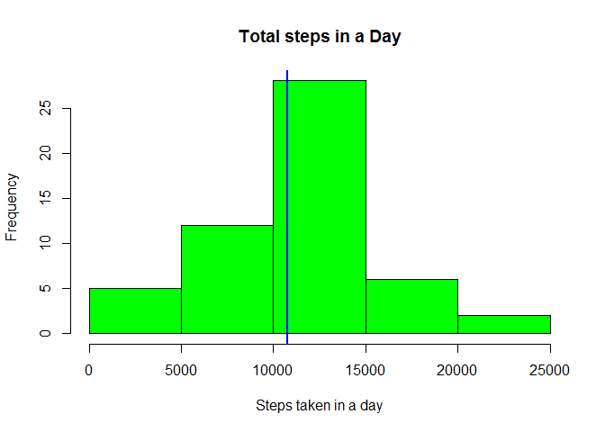
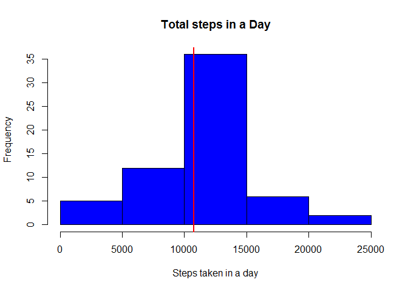

# Reproducible Research: Peer Assessment 1


## Loading and preprocessing the data  
  
The first step is to read the CSV file, reading the data and storing it in the variable named "activity".  

 

```r
activity <- read.csv("C:/Users/Vinay/Desktop/Coursera/R programing/activity.csv")
```

Now loading all the library packages required for further processing the data.   

 

```r
library(knitr) 

library(lattice)  

library(ggplot2)  

library(dplyr)  
```

```
## 
## Attaching package: 'dplyr'
## 
## The following objects are masked from 'package:stats':
## 
##     filter, lag
## 
## The following objects are masked from 'package:base':
## 
##     intersect, setdiff, setequal, union
```

```r
library(XML) 
```

 
Converting the date column from factor in to date format and saving it back in to the same data frame  

 

```r
activity$date <- as.Date(activity$date, format = "%Y-%m-%d") 
```


## What is mean total number of steps taken per day?  

Creating a data frame "dat" with the columns containing the Date as its first column and the total number of steps taken in a day. And then plotting the histogram for total number of steps taken per day. The blue vertical line indicates the median and white vertical line indicates the mean. 

```r
Totalsteps_taken <- rep(NA, length(unique(activity$date)))

Date <- rep("NA", length(unique(activity$date)))

Stepsinaday <- tapply (activity$steps, activity$date, sum, na.rm = TRUE)

for (i in 1: length(Stepsinaday)) {

        Totalsteps_taken[i] <- Stepsinaday[[i]]
        Date[i] <- names(Stepsinaday)[i]
}

dat <- data.frame (Date, Totalsteps_taken)  

hist(dat$Totalsteps_taken, main = "Total steps in a Day", xlab = "Steps taken in a day", col = "red")

abline (v= median(dat$Totalsteps_taken), col = "white", lwd = 2)

abline (v= mean(dat$Totalsteps_taken), col = "blue", lwd = 2)
```

 

```r
mean(dat$Totalsteps_taken)
```

```
## [1] 9354.23
```

```r
median(dat$Totalsteps_taken)
```

```
## [1] 10395
```
  
Creating the historgram for total number steps taken per day by using the aggregate function.  

```r
TotalSteps <- aggregate(steps ~ date, data = activity, sum, na.rm = TRUE)

hist(TotalSteps$steps, main = "Total steps in a Day", xlab = "Steps taken in a day", col = "green")

abline (v= median(TotalSteps$steps), col = "white", lwd = 2)

abline (v= mean(TotalSteps$steps), col = "blue", lwd = 2)
```

 

```r
mean(TotalSteps$steps)
```

```
## [1] 10766.19
```

```r
median(TotalSteps$steps)
```

```
## [1] 10765
```

 
## What is the average daily activity pattern?  

1. Make a time series plot (i.e. type = "l") of the 5-minute interval (x-axis) and the average number of steps taken, averaged across all days (y-axis)  

2. Which 5-minute interval, on average across all the days in the dataset, contains the maximum number of steps?  

Creating a table with the mean values of the steps taken per interval.  

```r
time_series <- tapply(activity$steps, activity$interval, mean, na.rm = TRUE)
```
  
The plot is.    


```r
plot(row.names(time_series), time_series, type = "l", xlab = "5-min interval", 
    ylab = "Average across all Days", main = "Average number of steps taken", 
    col = "blue")
```

 
  
Creating a variable to calculate the max interval.  


```r
interval_max <- which.max(time_series)

names(interval_max)
```

```
## [1] "835"
```


## Imputing missing values  
Note that there are a number of days/intervals where there are missing values (coded as NA). The presence of missing days may introduce bias into some calculations or summaries of the data.

1.Calculate and report the total number of missing values in the dataset (i.e. the total number of rows with NAs)  

Calculating the total number of mising values.  


```r
No_activity <- sum(is.na(activity))

No_activity
```

```
## [1] 2304
```
  
  
2.Devise a strategy for filling in all of the missing values in the dataset. The strategy does not need to be sophisticated. For example, you could use the mean/median for that day, or the mean for that 5-minute interval, etc.  


```r
average_steps <- aggregate(steps ~ interval, data = activity, FUN = mean)

fillNA <- numeric()

for (i in 1:nrow(activity)) {
    observations <- activity[i, ]
    if (is.na(observations$steps)) {
        steps <- subset(average_steps, interval == observations$interval)$steps
    } else {
        steps <- observations$steps
    }
    fillNA <- c(fillNA, steps)
}
```
  
  
3.Create a new dataset that is equal to the original dataset but with the missing data filled in.  

Creating a new data set called "new_activity" equal to the original, but the missing values filled in.   

```r
new_activity <- activity

new_activity$steps <- fillNA
```
  
  
4.Make a histogram of the total number of steps taken each day and Calculate and report the mean and median total number of steps taken per day. Do these values differ from the estimates from the first part of the assignment? What is the impact of imputing missing data on the estimates of the total daily number of steps?  
Now creating a variable to plot the histogram.  

```r
Totalsteps_taken2 <- aggregate(steps ~ date, data = new_activity, sum, na.rm = TRUE)
```
  
And the histogram is.


```r
hist(Totalsteps_taken2$steps, main = "Total steps in a Day", xlab = "Steps taken in a day", col = "blue")

abline (v= median(Totalsteps_taken2$steps), col = "white", lwd = 2)

abline (v= mean(Totalsteps_taken2$steps), col = "red", lwd = 2)
```

 
  
Calculating new mean and median of the total steps taken.  


```r
mean(Totalsteps_taken2$steps)
```

```
## [1] 10766.19
```

```r
median(Totalsteps_taken2$steps)
```

```
## [1] 10766.19
```
  
This histogram looks similar to the second histogram created during the second step. The mean and median values are almost equal.I think this is because, the zero values in the data frame are neglected while creating the histogram.  
  
## Are there differences in activity patterns between weekdays and weekends?  

For this part the weekdays() function may be of some help here. Use the dataset with the filled-in missing values for this part.    

1. Create a new factor variable in the dataset with two levels - "weekday" and "weekend" indicating whether a given date is a weekday or weekend day.    

2. Make a panel plot containing a time series plot (i.e. type = "l") of the 5-minute interval (x-axis) and the average number of steps taken, averaged across all weekday days or weekend days (y-axis). See the README file in the GitHub repository to see an example of what this plot should look like using simulated data.    

The following code creates a vector containing the names of the days and then looping through the vector and naming what day actually it is(either a weekday or weekend).    


```r
day <- weekdays(activity$date)
levelofday <- vector()
for (i in 1:nrow(activity)) {
        if (day[i] == "Saturday") {
                levelofday[i] <- "Weekend"
        } else if (day[i] == "Sunday") {
                levelofday[i] <- "Weekend"
        } else {
                levelofday[i] <- "Weekday"
        }
}
activity$levelofday <- levelofday
activity$levelofday <- factor(activity$levelofday)

stepsperDay <- aggregate(steps ~ interval + levelofday, data = activity, mean)
names(stepsperDay) <- c("interval", "levelofday", "steps")
```
  
  
The following is used to generate a panel plot showing comparision between average steps taken on weekdays and on weekends.  


```r
xyplot(steps ~ interval | levelofday, stepsperDay, type = "l", layout = c(1, 2), xlab = "Interval", ylab = "Number of steps")
```

 

